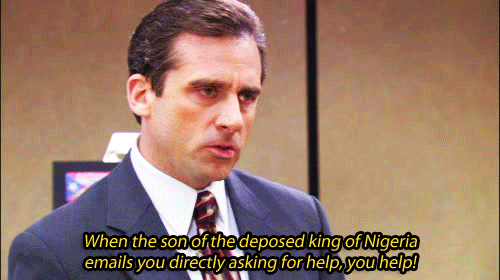
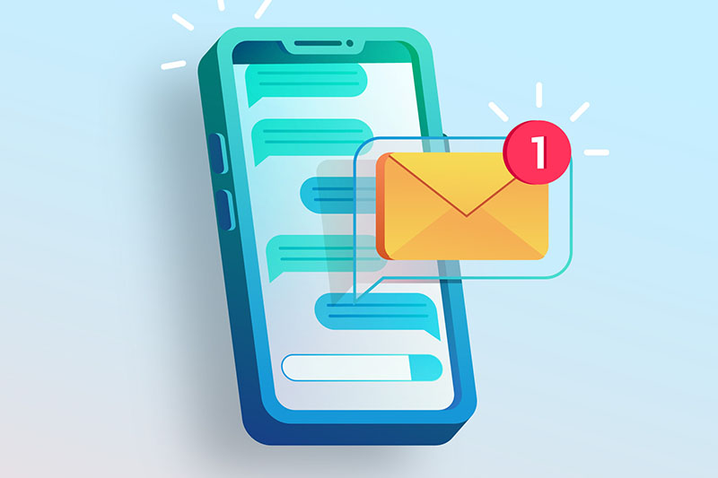
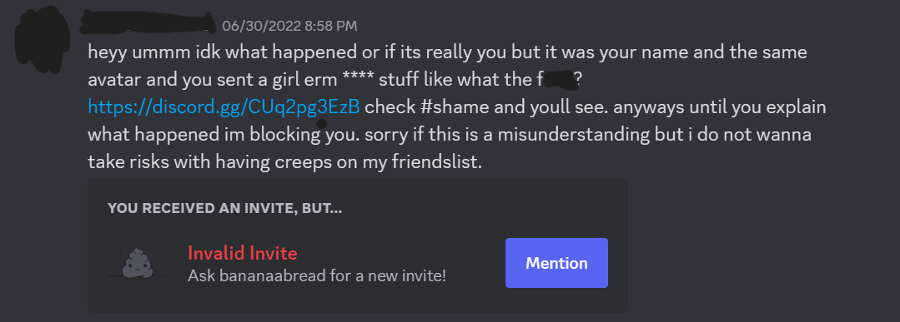

```{r setup, include=FALSE}
knitr::opts_chunk$set(echo = FALSE, warning = FALSE, message = FALSE)
library(tidyverse)
library(lubridate)
library(readr)
library(kableExtra)
library(janitor)
library(reshape2)
library(data.table)
library(ggplot2)
library(ggthemes)
library(gganimate)
library(ggcorrplot)
library(caret)
library(randomForest)
library(gam)
library(MASS)
library(car)
library(corpcor)
library(corrplot)
library(GGally)
library(scales)
library(Metrics)
library(latex2exp)
library(tidytext)
library(egg)
library(writexl)
library(ggforce)

```


# What is Spam?


In our interconnected world, where communication is predominantly facilitated through digital platforms, the prevalence of spam has become an all-too-familiar nuisance. From inundating email inboxes with unsolicited offers to bombarding messaging apps with deceptive links, spam has managed to infiltrate our daily lives and pose a significant challenge in maintaining a clutter-free digital environment. 

Defined as unsolicited and unwanted messages, spam has evolved into a multifaceted issue that spans across various forms of electronic communication. While its early roots can be traced back to the telegraph era, it is the advent of the internet and the subsequent explosion of online platforms that propelled spam into the spotlight. Today, we encounter spam in different shapes and sizes, manifesting as unwanted emails, text messages, comments on websites, social media posts, and even automated phone calls.

Its impact extends far beyond mere annoyance, as it poses genuine threats to both individuals and organizations. Phishing attempts, where scammers impersonate trusted entities to deceive recipients into revealing sensitive information, have become increasingly sophisticated. Malicious attachments and links embedded within spam messages can unleash malware, ransomware, or other damaging software that compromises personal and professional data security. Furthermore, the sheer volume of spam not only clogs up our inboxes but also hampers productivity, diverting valuable time and attention away from important matters.

Given the magnitude of the problem, significant attention and resources have been dedicated to combating spam. Internet service providers, email clients, and messaging apps continually refine their filtering algorithms to better detect and divert spam messages into designated folders or quarantine. Technologies like artificial intelligence and machine learning play pivotal roles in distinguishing between legitimate messages and unwanted spam, constantly adapting to evolving tactics employed by spammers.

Collaborative efforts involving government agencies, law enforcement bodies, and cybersecurity experts strive to identify and prosecute spammers, aiming to disrupt their operations and deter future attempts. Legislation has been enacted in numerous countries to regulate the sending of unsolicited commercial messages, with penalties imposed on those who violate these laws. Additionally, user education initiatives emphasize the importance of maintaining vigilance, raising awareness about common spam tactics and encouraging individuals to adopt best practices in protecting their digital identities.

By understanding the inner workings of spam and the ongoing efforts to combat it, we can empower ourselves to navigate the digital landscape with greater resilience and safeguard our digital interactions.


# Spammers and Scammers in Disguise - Spoofing



Now that we've got our spam-fighting gear on, let's dive into one of the sneakiest moves spammers pull off — spoofing! It's like their secret weapon, a digital disguise that makes their spammy messages look like they're coming from someone else entirely. Sneaky, right?

So, what exactly is spoofing? Picture this: you're scrolling through your messages, and suddenly, you see a text or an email that appears to be from your BFF, your bank, or even a legit company. But here's the catch—it's not really them! Spoofing is the art of forging the sender's identity to make it seem like the message is coming from a trusted source when, in reality, it's just a crafty spammer up to no good.

Now, you might be wondering, "How the heck do they pull this off?" Well, the spammers use all sorts of tricks up their sleeves. They manipulate the "From" field in emails or the caller ID in text messages to display a different name or number than the actual sender. It's like they're wearing a digital mask, pretending to be someone they're not.

Why do spammers go to all this trouble? It's simple—they're playing mind games, trying to deceive you into opening their messages or clicking on their sketchy links. By impersonating someone you trust, they aim to trick you into sharing sensitive info, falling for their scams, or even infecting your device with malicious software.

But don't sweat it! The good news is that there are tech warriors out there fighting tooth and nail against spoofing and its evil accomplice, spam. Messaging platforms, email providers, and cybersecurity experts are constantly leveling up their defenses to detect and block these phony messages. They're unleashing the power of artificial intelligence and machine learning to identify the telltale signs of spoofing and keep it at bay.

On top of that, authorities and cybersecurity organizations are joining forces to track down these shady spammers. They're busting their moves to enforce laws and regulations that slap hefty penalties on these digital tricksters. It's a united front against the spam invasion!

But remember, the most powerful weapon in this war against spoofing is knowledge. Stay alert and educate yourself about the sneaky tactics spammers employ. Look out for red flags like generic greetings, odd email addresses, or messages that demand immediate action. And, of course, always double-check the legitimacy of messages before sharing personal info or clicking on suspicious links.

So, how do we unmask these digital imposters and keep our inboxes safe and sound? In this post, I'll examine a personal case study of mine. 

Around June 2022, I noticed a significant uptick of spam on [Discord](https://discord.com/), a popular communication platform designed for communities, primarily focused on real-time voice, video, and text chat. I noticed spam in the Discord servers that I frequent as well as in my direct messages. Although most of these direct message spam messages came from users I had never interacted with before, imagine my surprise when my sister had suddenly sent me a suspicious message. 

This message had felt off from the moment I laid eyes on it. Not only was the content of the message falsely accusatory, but it simply didn't sound like the way my tween sister and I would usually communicate. See a censored version of the message below.




At the time of receiving the message, it wasn't flagged as spam or tagged as anything particularly suspicious. I had to use my own judgment to snuff it out as a fraudulent message. So, thankfully, I didn't interact or click on the fake Discord server invitation link. Nonetheless, this happening got me thinking about the following questions.


# Research Questions

How can we better detect spam messages when the sender uses spoofing like this? Can we quantify and characterize the texting behavior of a trusted source, thus creating a foundation for recognizing when a message breaks that behavior?

What kind of cues can help us determine when a trusted source suddenly sends an suspicious, potentially harmful message? 

Is there a way to define the irregularity of a message based on the past behaviors exhibited in a sender's texting behavior? 


# Discord Spam Case Study  
As a brief preliminary case study into spam detection in the presence of spoofing, I compiled my Discord direct messaging history being myself and my younger sister, including the suspicious spam message that her account had sent me back in June of 2022. 

Note that all but one of the 686 Discord messages that my sister sent me are not spam. Only one message (pictured above) is certified spam. My goal is to see if I can characterize and quantify my sister's Discord messaging behaviors, to see if that spam message stands out as quantitatively irregular from the pattern that her other messages exhibit. 

See the first five rows of our data below (excluding author ID and author name).

```{r}

sister_df <- read_csv("sister_df_proc.csv")
sister_df <- sister_df[, -c(1)] %>%
  rename(observation_id = `Unnamed: 0`)
sister_df <- as.data.frame(sister_df)
```

In order to assess quantitative differences, we will quantify my sister's messages as a whole entity rather than word for word, though this may be of interest for future analysis.

In this dataset of messages sent from my sister's account, we retain information on observation_id (a unique identifier for each message), author ID (which is the same throughout the dataset and appears as extra confirmation that these messages are indeed all sent from the same account), author (the name of my sister's account), content (the message sent itself), a variable to indicate a message as spam or not (a value of 1 is spam and 0 is not-spam; only one message has a value of 1), and 8 other quantitative measures which we will go through in the subsequent sections. 


```{r}

head(sister_df[, -c(1:3)], 5)

tf1 <- read_csv("tf1_df.csv")


```

All data collection, basic feature selection, pre-processing, and advanced text processing were performed using the pandas, NumPy, NLTK, TextBlob, and scikit-learn libraries in Python v. 3.8.13.

# Data Prep and Preprocessing

## Number of Words

We start with something fairly simple: extracting the number of words in each message. The basic idea behind this is that if we have a messenger that often send messages in fragments (like sending new ideas in separate messages) or the opposite, often sends their messages in lengthier paragraphs, suddenly straying away from an established pattern like that could raise a red flag for concern. Additionally, generally negative sentiments contain a lesser amount of words than the positive ones - the spam message sent from my sister's account being particularly negative in nature.

```{r}


ggplot(data = sister_df, aes(x = observation_id, y = word_count, col = as.factor(spam))) +
  geom_point(size = 5) + labs(col = "Spam?", y = "word count",
                              x = "observation ID",
                              title = "Word Count by Observation",
                              subtitle = "Colored by Spam Status") + theme_bw() 

```

Right off the bat we see something very interesting. It seems that my sister is the type to send short-formed message or to send her messages in separate pieces. The spam message, marked above by the blue point on the scatterplot has a noticeably higher word count than any other single message that my sister has sent me. This is interesting and is our first indication that a message is irregular and may not actually be sent by the source the messenger is claiming to be. 

## Number of Characters

Similarly, we can look at number of characters in each message to detect irregularity. Note that the calculation of number of characters also includes number of spaces which generally can be removed if desire. But for our purposes, we retain information on number of spaces as well.

```{r}

ggplot(data = sister_df, aes(x = observation_id, y = char_count, col = as.factor(spam))) +
  geom_point(size = 5) + labs(col = "Spam?", y = "character count",
                              x = "observation ID",
                              title = "Character Count by Observation",
                              subtitle = "Colored by Spam Status") + theme_bw() 


```

Although it's not always guaranteed that we'd see similar results when we compare word count and character count, in our case, we do see the same takeaway that the number of characters in the spam message is suspiciously higher than the character count of messages that my sister usually sends me.

## Average Word Length

We also extracted another feature which calculates the average word length of each message. 

```{r}

ggplot(data = sister_df, aes(x = observation_id, y = avg_word, col = as.factor(spam))) +
  geom_point(size = 5) + labs(col = "Spam?", y = "avg. word length",
                              x = "observation ID",
                              title = "Average Word Length by Observation",
                              subtitle = "Colored by Spam Status") + theme_bw() 


```

When it comes to average word length, our spam message doesn't particularly stand out. Instead, it's buried among the non-spam messages and doesn't stand out as irregular in our case. 

## Proportion of stopwords

When solving a natural language processing (NLP) process, the first thing that we generally do is remove the stop words. However, before we loose this information, calculating the number of stop words can also lend us some extra information. 

For reference, a stop word is a commonly used word that carry very little useful information. Examples of stop words are "a", "the", "is", "are", etc.

We imported stopwords from the NLTK, an NLP library in Python. For subsequent metrics, we will look at ratios with number of words in the message as a consistent denominator in order to get a better metric of relativity between our messages.

```{r}

ggplot(data = sister_df, aes(x = observation_id, y = stopwords/word_count, col = as.factor(spam))) +
  geom_point(size = 5) + labs(col = "Spam?", y = "proportion of stopwords",
                              x = "observation ID",
                              title = "Proportion of Stopwords by Observation",
                              subtitle = "Colored by Spam Status") + theme_bw() 

```


Interestingly enough, we observe that about half of the words in the spam message are stop words. This ratio is a bit higher than the ratios seen in the majority of messages, though not the highest ratio observed. However, we'll do well to note that the more content a message has, the more stop words we expect to be in that message in order to separate and properly tie in the more informative words. So, this association makes sense based on what we've observed.

## Proportion of special characters

Another interesting featured that we extracted from the messages is the proportion of hashtags or mentions ('#') present in it. 

```{r}

ggplot(data = sister_df, aes(x = observation_id, y = hastags/word_count, col = as.factor(spam))) +
  geom_point(size = 5) + labs(col = "Spam?", y = "proportion of tags (#)",
                              x = "observation ID",
                              title = "Proportion of Tags (#) by Observation",
                              subtitle = "Colored by Spam Status") + theme_bw() 

```

Excluding the use of the '#' character for links or attachments, we see that the spam message is the only time that I was sent a message from my sister's Discord account where a tag or mention was included. Clearly, this is not behavior that my sister normally exhibits in her text so it's unusual that this special character suddenly appeared in a message. 

## Proportion of Numerics 
Like we calculated the number of words, we also calculated the proportion of numerics present in each message. 

```{r}

ggplot(data = sister_df, aes(x = observation_id, y = numerics/word_count, col = as.factor(spam))) +
  geom_point(size = 5) + labs(col = "Spam?", y = "proportion of numerics",
                              x = "observation ID",
                              title = "Proportion of Numerics by Observation",
                              subtitle = "Colored by Spam Status") + theme_bw() 

```

In the case of my messaging history with my sister, the number of numerics in a single message maxes out at over 0.3, with most messages having a proportion of 0. The spam message also has zero numerics, so the proportion of numerics isn't a strong signal in this case.

## Proportion of Uppercase Words

Anger, rage, or passion is quite often expressed by writing in UPPERCASE words which makes this a necessary operation to identify those words sent with just a little more 'umph'. 

```{r}


ggplot(data = sister_df, aes(x = observation_id, y = upper/word_count, col = as.factor(spam))) +
  geom_point(size = 5) + labs(col = "Spam?", y = "proportion of uppercase words",
                              x = "observation ID",
                              title = "Proportion of Uppercase Words by Observation",
                              subtitle = "Colored by Spam Status") + theme_bw() 


```

The top insight here is that my sister frequently sends messages with a lot of uppercase words - some with even ALL uppercase. However, she seems to send just as much messages with no uppercase words at all. Being that no uppercase words were found in the spam message, this feature isn't helpful to us in this case. 

## Sentiment Analysis

Sentiment analysis is described as the process of computationally identifying and categorizing opinions expressed in a piece of text especially in order to determine whether the writer's attitude towards a topic is positive, negative, or neutral.

We can extract the polarity of these messages which indicates the sentiment. These values range from -1 to 1. A value nearer to 1 means a positive sentiment and values nearer to -1 means a negative sentiment.

```{r}

ggplot(data = sister_df, aes(x = observation_id, y = sentiment, col = as.factor(spam))) +
  geom_point(size = 5) + labs(col = "Spam?", y = "sentiment",
                              x = "observation ID",
                              title = "Sentiment by Observation",
                              subtitle = "Colored by Spam Status") + theme_bw() 


```

Notably, the spam message exhibits a more negative sentiment. What's to note here is that my sister sends messages with both positive and negative sentiment, though the majority of messages (85.6%) that she sends are deemed as neutral (polarity = 0). 10.3% of messages sent lean positive, and the remaining 4.1% lean negative (the spam message being one of them). Though the negative sentiment of the spam message doesn't particularly stand out in quality and quantity, it may raise a flag that the message belongs to the minority class of negative sentiments. 

```{r}

# positive sentiment
#sum(sister_df$sentiment > 0)/sum(!is.na(sister_df$sentiment))

# neutral sentiment
#sum(sister_df$sentiment == 0)/sum(!is.na(sister_df$sentiment))

# negative sentiment
#sum(sister_df$sentiment < 0)/sum(!is.na(sister_df$sentiment))

```

# What's the So What?

In the case of my messaging history with my sister, word count, character count, proportion of special characters (#), and more weakly, proportion of stopwords and text sentiment were signals that demonstrated irregular behavior from the behavior that my sister usually exhibits when messaging me on Discord. 

So, it seems that we may be able to use even basic text characterization features to identify irregular SMS behavior. The complex issue is identifying spam when it seems to be coming from a trusted source. It's important that we're able to develop some metrics, either basic or advanced, to hoist those red flags in our mind before falling prey to a potentially harmful attack! 

Let's say we don't have data or the time/resources to do a whole analysis on our text data to determine whether or not a trusted source is being spoofed? We can all be detectors of spam by starting with a view simple questions.

## Don't Fall Into a Spam Trap: Stop. Breathe. Think!

Here are some basic tips that you can apply the next time you get a suspicious message from a trusted source to prevent being a victim of spam or malicious scam attack. In a Nutshell: Think Before You Act!

- Stop. Breathe. Think. Is there any merit to the claims that this trusted source is supposedly making out-of-the-blue?

- Is the nature of the message suspiciously passive aggressive or guilt-trippy?

- If you can, contact this trusted source through a different platform than the platform that you received the message on (e.g. phone, another social media platform, etc.) to confirm the sender before taking any action.

- If on a messaging platform like Discord or Slack, look up the name of the public server or channel that they seem to be inviting you to before accepting the invitation to confirm it's legitimate.  

Oftentimes, these types of messages will try to taken advantage of the victim by fear mongering them and/or accusing them of something heinous, threatening the victims social status or reputation if the victim doesn't act quickly. It's important to realize when a spammer is trying to manipulate the vulnerability of a victim. 

These malicious actors try to get the victim flustered and frantic with false claims about slander being spread about them online, or their finances and other sensitive information being under immediate threat. Young children and the platforms that young people often frequent like Discord are often targets of particular interest due to younger individuals generally being more gullible and susceptible to cyber threats. 

This is why it's always important to stop, breathe, and think. Take the precautionary actions recommended above before responding to a message like this before the damage done is irreversible. 


# Next Steps - More Questions to Think About for Future Analysis

Moving forward for future analysis, we can think about the following questions:

- How many messages would you need to exchange for it to be enough to define the messaging behaviors of an individual? How long would these messages have to be (word or character count)? 

- How irregular from a person's messaging pattern would a message have to be in order to be marked by spam? 

- What can the individual words used in these spam messages reveal about their spam status and how are the different from the words used in non-spam messages, if at all?

- Do these insights hold up when compared to the spoofing behaviors that other Discord users have seen in their direct messages? 

- If we were to look closely into the words contained within each message, what metrics would be best considered there? Term frequency - inverse document frequency may be an analysis of interest. 


Let's continue to develop the field of anti-spam and fight against vectors of abuse including the complex problem space of spoofing!